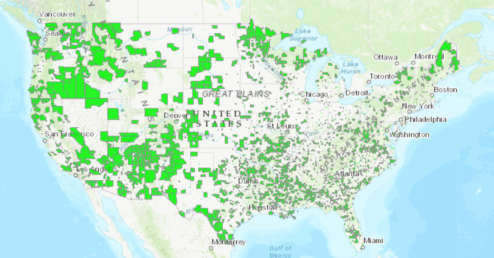

# Food Desert Prediction 

Prediction and analysis of food deserts from health behavioral data and twitter sentiment in the US.

## Inspiration
Nutrition and overall access to food is a critical component to well-being and the overall health of an individual. Unfortunately, many regions around the world lack access and ability to consume fresh and quality foods and as a result are suffering to consume the essential components of a healthy diet. Food deserts are the areas across the United States, often low-income, where there is limited access to nutritious and affordable food, especially fruits vegetables, whole grains, and low-fat milk. More specifically, food deserts are census tracts where more than 500 people or over 33 percent of the population in that tract must travel over a mile for fresh groceries. 

With food desert data only being released every 5 years, preventative action could be taken to reverse at-risk regions if we could catch these regions in advanced.

## Goal/Scope
I am predicting food deserts using health behavioral statistics in order to provide more up-to-date predicitons of risk census tracts. I perform additional analysis on the sentiment in social media to try to improve my model and uncover how the prevalence of grocery stores impacts what people talk about on twitter.

 
## Datasets
I utilized health behavioral data from the Population Health Division of the Centers for Disease Control and Prevention. This dataset contains statistics regarding overall health for census tracts across the United States.

I additionally pulled social media twitter data through the Twitter API to analyze patterns of healthy vs. unhealthy consumption. To accomplish this filtered search, I created lists for the following 4 topics and pulled any mention of any of the words in these lists over a span of 1.5 weeks:

|  |  | |  | |
| ------ | ------ | ------ | ------ | ------ |
| mcdonald's | starbucks | subway | wendy's | burger king | 
| taco bell | dunkin donuts | chick fil-a | pizza hut | domino's | 
| panera bread | sonic | kfc | chipotle | carl's jr | 
| dairy queen | arby's | little caesars | jack in the box | popeyes louisiana kitchen | 
| papa john's | panda express | whataburger | jimmy john's | zaxby's | 
| five guys | culver's | bojangles | steak n shake | wingstop | 
| papa murphy's | checkers | jersey mike's | qdoba mexican | church's chicken | 
| el pollo loco | del taco | white castle | tim hortons | moe's southwest grill | 
| firehouse subs | boston market | jason's deli | in-n-out | baskin-robbins | 
| mcalister's deli | auntie anne's | captain d's | jamba juice | 
|  |  | |  | |
    
    - Top grocery stores/supermarkets
    
    - Unhealthy foods
    
    - Healthy foods

## Data Processing

I first merged the food desert target data with population health records using census tract as the key. This allowed me to associate each record with a y target. I narrowed my feature matrix from over 300 features down to 15. After running initial models using this data alone, I decided to incorporate twitter sentiment.

Over the span of 1.5 weeks, I was able to collect over 3 million tweets that fell into one of the four above categories. Because I was interested in mapping these tweets back to my population health dataset, I only wanted to look at geotagged tweets from the United States.
    - I removed any tweets with country code other than "US" and language other than "eng"
    - I filtered out the tweets without coordinate information and reduced my dataset to about 20,000 tweets

Next, I mapped back each of the latitude, longitude coordinate pairs to a corresponding US census tract using the Federal Comminucations Commission API. This allowed me to merge the twitter data with the population health data.

## Food Desert Prediction

## Results

## Interactive Visualizations

==============
## Implementation Details ####

## Tools ####
1. Twitter API
2. FCC API
3. MongoDB
4. Amazon Web Services
5. NLTK
6. Mapping coordinate software (fill in with the tools used here)
